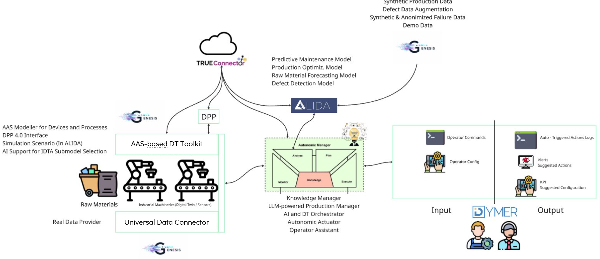

# Autopilot

## Overview
Autopilot serves as the central orchestration engine designed to facilitate autonomous decision-making and process coordination within complex Industrial Internet of Things (IIoT) environments. It serves as the primary **AI and Digital Twin (DT) Orchestrator**, acting as an intelligent Operator Assistant and leveraging on LLM-powered Production Manager to interpret operational data, execute logic, and coordinate disparate industrial tools.

The system is architected to function as the cognitive core of the ecosystem, implementing a Monitoring, Analysis, Planning, and Execution (MAPE-K) loop. It bridges the gap between raw industrial data, predictive analytics, simulation environments, and human operators, ensuring seamless interoperability across the production lifecycle.

## System Architecture

The architectural design illustrated above places **Autopilot** at the center of a hub-and-spoke model, managing the entire data lifecycle of the industrial process:

1.  **Data Ingestion (Left):** The flow begins with the **Universal Data Connector** and **AAS-based DT Toolkit**, which ingest real-world data from industrial machinery and raw materials providers.
2.  **Central Orchestration (Center):** This data reaches the Autopilot, which operates using a **MAPE-K loop** (Monitor, Analyze, Plan, Execute, Knowledge). It acts as the brain of the system, consulting external services like **Alida** for predictive modeling, **Genesis** for synthetic simulations, and **TrueConnector** for secure external data exchange.
3.  **Human Interaction & Output (Right):** Finally, actionable insights, alerts, and configurations are routed to **Dymer**, interfacing directly with human operators to display logs or receive manual commands.

### Core Responsibilities
* **Orchestration:** Coordinates tasks between data connectors, predictive models, and simulation engines.
* **Cognitive Processing:** Utilizes GenAI and RAG (Retrieval-Augmented Generation) to understand user prompts and contextualize industrial data.
* **Task Execution:** Converts high-level goals into executable code or API calls directed at peripheral systems.
* **Knowledge Management:** Maintains the state of assets, schedules, and maintenance needs.

## Ecosystem Components

Autopilot manages a suite of specialized tools, each addressing a specific domain within the industrial framework. Below you can find their respective repositories and documentation.

### Dymer
**Human-in-the-Loop Interface**
DYMER is a dynamic user interface framework designed to bridge the gap between autonomous AI decisions and human operators. It provides a configurable dashboard that adapts to incoming data streams to visualize process states and capture manual feedback.
* **Function:** Real-time visualization of KPIs, management of AI-generated alerts, and execution of operator commands.
* **Usage:** Enables operators to validate "Suggested Actions" proposed by the Autopilot, monitor auto-triggered logs, and input configuration parameters to fine-tune the production environment.

[> Go to Dymer Documentation](https://github.com/Engineering-Research-and-Development/DYMER)
---

### Universal Data Connector (UDC) & Pulsar Bridge
**Industrial Data Acquisition and Streaming Middleware**
This composite module forms the data ingestion backbone of the ecosystem, bridging the gap between physical shop floor assets and the digital processing core. It ensures that data from heterogeneous sources is normalized and reliably transported to the Autopilot.
* **Universal Data Connector (UDC):** A modular gateway designed to interface with diverse industrial data sources. It abstracts specific machine protocols to provide a normalized data stream for downstream applications.
* **Pulsar Bridge:** A middleware that facilitates scalable data transport. It consumes MQTT/OPCUA messages from edge devices and forwards them to an Apache Pulsar cluster which tracks and maintains the AAS digital twins updated.

[> Go to Universal Data Connector Documentation](https://github.com/Engineering-Research-and-Development/universal-data-connector)
[> Go to Pulsar-Bridge Documentation](https://github.com/Engineering-Research-and-Development/bridge-MQTT-Pulsar)

---

### Genesis
**Synthetic Data Generation**
Genesis is the simulation engine responsible for generating artificial production data. It is utilized to test scenarios where real-world data is scarce or sensitive.
* **Function:** Testing, training, and validating machine learning models, as well as for generating data.
* **Usage:** Generates large-scale synthetic datasets to train Alida's predictive models and populate digital twin simulations with rare failure scenarios.

[> Go to Genesis Documentation](https://github.com/Engineering-Research-and-Development/synthetic-data-generator)

---

### Alida
**Predictive Analytics and Model Management**
Alida is a platform designed to democratize the creation and management of Big Data Analytics (BDA) workflows. It provides a visual, drag-and-drop environment (Workflow Designer) that abstracts the complexity of underlying processing engines, allowing for the rapid design of data pipelines.
* **Function:** Orchestrates the full lifecycle of data analytics, from design and configuration to instantiation and monitoring. It utilizes a catalogue of reusable BDA services to build complex workflows without deep coding requirements.
* **Integration:** Serves as the execution engine for the specific predictive maintenance and forecasting tasks requested by Autopilot, ensuring that high-level analytical goals are translated into executable data processes.

---

### TrueConnector
**Data Sovereignty and Exchange**
TrueConnector ensures secure and standardized data exchange, functioning as the gateway to the International Data Spaces (IDS) ecosystem. It is built upon FIWARE components to guarantee interoperability and trusted data sharing.
* **Function:** Manages the usage control policies and secure data transfer between the local ecosystem and external stakeholders.

[> Go to Genesis Documentation](https://github.com/Engineering-Research-and-Development/fiware-true-connector).