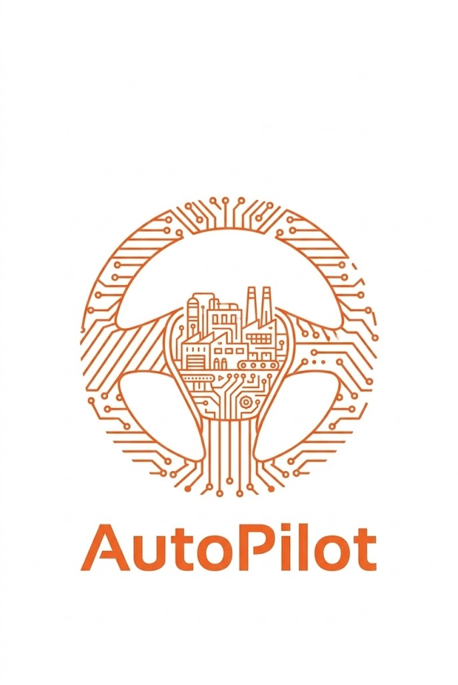
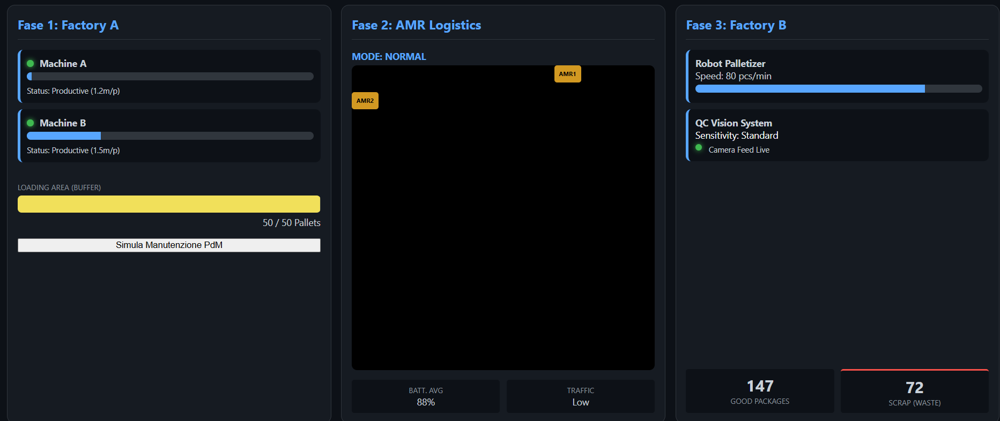

  

---

# 💡 AutoPilot

## Overview

**AutoPilot** is the central engine for autonomous decision-making and process coordination in complex **Industrial Internet of Things (IIoT)** environments. It acts as the cognitive core of the ecosystem, orchestrating **AI-driven reasoning** and **Digital Twin (DT)** semantics to interpret operational data, trigger analytical workflows, and coordinate industrial tools, with or without human intervention.

The system is built around a **MAPE-K loop** (Monitor, Analyze, Plan, Execute, Knowledge), which serves as the architectural foundation. This loop continuously ingests data from the shop floor, evaluates the current state of assets through their digital representations, generates actionable decisions, and executes them across the connected infrastructure.

---
## Application Levels

AutoPilot scales across three distinct functional tiers to address the complexity of modern industrial environments:

1.  **Level 1: Physical World Application**
    The core operational layer where AutoPilot manages the real-time coordination of physical assets (PLCs, sensors, actuators). Beyond simple actuation, this level incorporates Edge Analytics, utilizing local processing to handle critical threshold monitoring and ML-at-the-edge. This ensures that the shop floor can respond to physical events with immediate, low-latency intelligence without relying on cloud round-trips.
2.  **Level 2: AI Systems Maintenance**
    The meta-cognitive layer. AutoPilot performs Meta-Analytics, which involves "analyzing the behaviour of the analyses" monitoring the health, accuracy, and performance of the AI models themselves. By detecting model drift and managing versioning, it enables a Model Lifecycle Planning,  scheduling re-training or fine-tuning workflows, ensuring that the decision-making logic remains sharp as industrial conditions evolve.
3.  **Level 3: ML Operations & Metadata Accumulation**
    The strategic data layer. AutoPilot acts as a high-level orchestrator for Long-Term Analytics, accumulating rich metadata and structured historical logs into a "Knowledge" base. This "data lake of experiences" allows for deep historical analysis on metadata, enabling advanced ML Operations (MLOps) such as strategic decision-making with global process optimization, predictive maintenance at scale, and the discovery of entirely new operational patterns.

---

## 👥 Human in the Loop (HITL)

While AutoPilot is designed for high autonomy, it incorporates a robust **Human-in-the-Loop** framework. Autonomous systems in critical industrial sectors require trust and validation.

* **Decision Validation:** For high-impact or non-deterministic plans, AutoPilot surfaces the proposed action plan to a human operator via a dedicated cockpit.
* **Explainability:** Leveraging its XAI capabilities, the system provides the "why" behind a decision, allowing the operator to validate the logic before execution.
* **Active Intervention:** Operators can mass-override autonomous decisions or adjust policy constraints in real-time, feeding human expertise back into the Knowledge layer to refine future autonomous behavior.

---
## System Architecture: The MAPE-K Loop

The architecture is defined by the **MAPE-K** cycle, where data flows in from industrial assets, is processed through a semantic reasoning layer, and actionable outputs are routed back to the field.

The **Asset Administration Shell (AAS)** standard serves as the semantic backbone of this architecture, ensuring that every asset, its data, and its behavior are consistently described and interoperable throughout the loop.

![AutoPilot MAPE-K Architecture](https://kroki.io/d2/svg/eNrVV81u20YQvuspBjYQtAeloiTHilAUIOQYLWKjSuTcdFlyh9LCy12CXEJRggA59FSgyKEGiviS5tRTTz205z6KX6B9hM6SFCValGShOTiABIn7MzvzfTPfLLmI0TdCqz5wPVONxiHcXL3NPzAyQgqYSO0x-i3HP6NPo-FLliSY9OF1A0BqHTWV5pg_AiRTFtGDxYCpicR80MxluQLA0zHHuBkzLlKy47SL8UAr00zEK1rqHJVrJe-DiVNcLBJS9uHg0MH24453UIwmJtaXaMc7PY8Hvep4cya4mfahcpCvpY7tDmxjL2iVO6aMeFs58k0j_14qPZPIJ1gXrz-XQlFQdeGuhtXdFVbHIW-c9bB6Ts_fM6wWHgfBzrACgZLXhTTFl2yi1f-OyOkeddp8PaIu49hr7RMR9wMfj3dGxOJYz5ohE6qMqOr-fsnClAiZQb7xpDIxdh63jUSnOspZQoPdmuMywnYedRd0N0b2pqpaA2KB0EQi4dwdPmk-hTMqe7jHGhVSBl8WCsU8tHl48-EPWLjvpkYrHQo_Cy3WMgvIglXB87ZOPWqs5nUrcI7b7KCxOaPqUF8tnUeNmsKppvwx553Az81xnXoSm7lX5Q7iCiDUShi7I3d8EfO_H65-gvN8bqzuDuBYDbSUJOHwwIZrkHbHbAYGJYZo4nnuUNYJ-ssesPCGKSbnr3Ddm59_BDef28-bEzTWGUacUd_EZKweQNaEEsKYMni7O5Fkat2X336FIU3s58gIM1QYZxGdS01-rIhk8mCyAxJ8iX5q1iC5uX7_z1_v4Ek-u58vbhTJOTDfpIUnvg5Dpniy3ZNDOJVpkmiIYqF8ETGJwFFmC5eZBM1vNtE4moeR0WH1mKXmLrQq32zt1OF_IthE6UTssGK3WhMb4HOzi1bG4zY7m-Xs6UK64YzNMYZ7JmO3OssyeX_5wabNuvtvr8B1R3sKmYOO1_VuC9lqr_oEQsaOvO4dhIyxpEY2rsGlajfg8lAokVWc5X00RSn3KZq9NEdMhGESLmZCwd9_wij1QiojSeLzLbmgY-HT7AkzzM4OtRR-pkxuqQ3wPJVYTfDqHbIuOU9td_8s3ww2p_HKjWVJ6rvfAb5TPCU2BQE5mtKN4pREKP7UhI7V8GyQMYgq0XFi_7qZatLDWH0_HDRfuPAVnD-7uABUPNJCmYy2grTlDblGSRQ1IeJarNTi1yRY9-OCVFyEHi7E2HpWpuDDstYWpDxLMZ4TEi8iXjTVip6WOy0MueFMn3dYzaqArBJYtnJvgbvRdCH5u6wXLeBMT7Yb3URbXm_3h7KayrENMMekcs1b0cePcLG4mY3VF5WM_nINlszmOs50SE2d3lx_LIrFojxYuWFUGsyybQRHj7HlbW4bNe8c1UYR-LzTLV4XKx3FSuV_nesY5w==)

### **MAPE-K Implementation Logic**

| Phase | Operational Role |
| :--- | :--- |
| **🔍 Monitor** | Data ingestion and connectivity from industrial assets. |
| **📊 Analyze** | Real-time stream processing and analytics. |
| **🧠 Plan** | AI-driven decision making and workflow orchestration. |
| **⚙️ Execute** | Actuation and downstream pipeline triggering. |
| **📚 Knowledge** | Persistent storage of time-series asset data and Digital Twin semantics. |

#### **Monitor — Data Ingestion & Connectivity**
The monitoring layer is responsible for the semantic digitalization of the shop floor. It implements **multi-protocol ingestion** (OPC-UA, MQTT, REST, Modbus) to bridge heterogeneous and legacy systems. Through **edge buffering** and **durable message streaming**, it ensures data integrity before applying **AAS semantic annotation**, effectively transforming raw telemetry into context-aware Digital Twin data points.

#### **Analyze: Stream Processing & Analytics**
This layer performs real-time evaluation of asset health and process stability. It combines anomaly detection and KPI computation with advanced process conformance checking to identify operational drifts. Beyond tabular data, it handles signal and image analysis, while a Query interface allows operators to interrogate complex operational states. Every alert is accompanied by a root-cause justification.

#### **Plan: AI-Based Decision Hub**
The planning layer acts as the system's reasoning engine, utilizing LLMs to derive adaptation strategies from the current AAS context. It manages constraint-based scheduling while orchestrating workflows for long-running processes. 

#### **Execute: Actuation**
Execution closes the loop by translating high-level plans into device command dispatches. It handles the routing of alerts and human-in-the-loop escalations, ensures the triggering of downstream pipelines, and provides robust rollback and compensation mechanisms. This phase monitors actuation feedback to verify that the physical state aligns with the intended adaptation.

#### **Knowledge Storage & Semantics**
The knowledge layer provides the unified "source of truth". It integrates time-series storage for historical telemetry with a vector store for semantic RAG retrieval. At its core, the AAS submodel repository and Digital Twin registry define the environment's structure, while a dedicated policy management module governs the adaptation rules and constraints used by the planning phase.

---

## 🏭 Operational Showcase: A "Smart Factory" Orchestration

To understand how AutoPilot operates in practice, consider a **multi-stage integrated production line** consisting of automated manufacturing, autonomous logistics, and smart quality control.

### **Scenario Breakdown**

In this environment, AutoPilot acts as the "cognitive orchestrator" across three distinct zones, utilizing the full **MAPE-K loop**:

#### **Phase 1: Factory A (Production)**
* **Monitor:** Ingests real-time telemetry from *Machine A* and *Machine B* via protocols like **OPC-UA** and **Modbus**.
* **Analyze (Level 1):** Performs **Edge Analytics** to compute throughput (e.g., 1.2m/p) and monitor critical thresholds for anomaly detection.
* **Event:** If a "Maintenance Simulation" is triggered, AutoPilot detects the performance drift immediately via real-time alerting.

#### **Phase 2: AMR Logistics (Inter-stage Transport)**
* **Plan (Level 2):** Performs **Meta-Analytics** on the production trend of Phase 1, monitoring model health and performance.
* **Adaptive Reasoning:** Using **RAG-grounded LLMs**, the system determines that a slowdown in Phase 1 requires a "Normal" or "Energy Saving" mode for the **Autonomous Mobile Robots (AMR)**.
* **Spatial Coordination:** AutoPilot manages the **spatial path planning** for AMRs to ensure the loading area (buffer) does not overflow.

#### **Phase 3: Factory B (Packaging & Quality Control)**
* **Execute:** The *Robot Palletizer* receives **actuation commands** to synchronize its speed (e.g., 80 pcs/min) with the incoming supply.
* **Advanced Analysis:** A *QC Vision System* performs **image analysis** to identify "Scrap" (waste) vs. "Good Packages".
* **Knowledge (Level 3):** All QC results and operational metadata are stored in a **time-series and vector store** for **Long-Term Analytics**. This allows the system to correlate Phase 3 waste with Phase 1 machine settings over time.

### **The Value of Autonomous Coordination**
This cross-domain synchronization ensures that a bottleneck in *Factory A* doesn't result in wasted energy in *Logistics* or idle machinery in *Factory B*. 

**Human-in-the-Loop (HITL):** The operator is engaged for **massive validation** only when the system detects high-impact anomalies, such as a sudden spike in "Scrap" (72 units), providing the **explainable root-cause** (XAI) needed to adjust QC sensitivity or machine parameters safely.
